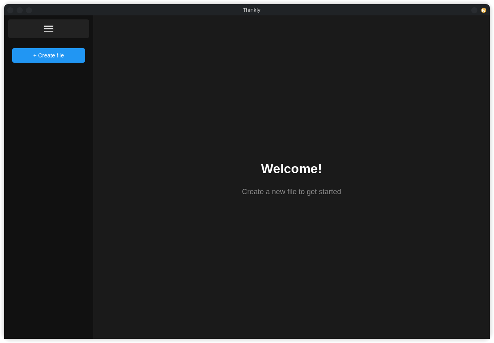

# Thinkly

##  Screenshot


##  Features

### File Management
- **Create Files** - Quickly create new text files with custom names
- **File List** - Visual sidebar showing all your saved files
- **Auto-Save** - Automatic saving every 500ms after editing stops
- **Persistent Storage** - Files saved to `Documents/Thinkly/saves/`
- **Quick Access** - Click any file to instantly open and edit
- **Delete Files** - Remove unwanted files with confirmation

### Editor
- **Plain Text Editing** - Fast, responsive textarea
- **Auto-Save Indicator** - Files save automatically while you type
- **Welcome Screen** - Friendly message when no file is selected
- **Distraction-Free** - Clean interface focused on your content

### Interface
- **Collapsible Sidebar** - Toggle sidebar visibility with hamburger menu
- **Responsive Design** - Adapts from 100x100px to any screen size
- **Dark Theme** - Easy on the eyes with modern dark UI
- **Custom Scrollbars** - Thin, unobtrusive scroll indicators
- **SVG Icons** - Sharp, scalable Material Design icons
- **Smooth Animations** - Polished transitions and hover effects

##  Quick Start

### Prerequisites

**Ubuntu/Debian:**
```bash
sudo apt install qt6-base-dev qt6-webengine-dev qt6-webchannel-dev cmake g++
```

**Fedora:**
```bash
sudo dnf install qt6-qtbase-devel qt6-qtwebengine-devel qt6-qtwebchannel-devel cmake gcc-c++
```

**Arch Linux:**
```bash
sudo pacman -S qt6-base qt6-webengine qt6-webchannel cmake gcc
```

### Build from Source
```bash
git clone https://github.com/Max-Mend/thinkly.git
cd thinkly
mkdir build && cd build
cmake ..
make
./program
```

### Or use CMake directly:
```bash
cmake -S . -B build
cmake --build build
./build/program
```

##  Usage

### Creating Files
1. Click **"+ Add file"** button in sidebar
2. Enter a filename in the dialog
3. File is created and opened automatically
4. Start typing - your work saves automatically

### Opening Files
1. Click on any file name in the sidebar
2. File content loads instantly
3. Edit as needed - changes save automatically

### Deleting Files
1. Click the trash icon next to any file
2. Confirm deletion in the dialog
3. File is permanently removed from storage

### Sidebar Navigation
- Click the **☰** hamburger menu to collapse/expand sidebar
- Sidebar auto-collapses on screens narrower than 600px
- Settings button at bottom (placeholder for future features)

##  Technical Details

### Built With
- **Qt6** - Cross-platform application framework
- **Qt WebEngine** - Chromium-based web rendering
- **Qt WebChannel** - Bridge between C++ and JavaScript
- **HTML/CSS/JavaScript** - Modern web technologies
- **Material Design Icons** - Google's icon system

### Architecture
```
program/
├── main.cpp                 # Application entry point
├── core/
│   ├── MainWindow.cpp/h    # Main window and WebEngine setup
│   ├── FileManager.cpp/h   # File I/O operations
│   └── WebEngine.cpp/h     # Legacy web engine (unused)
└── ui/
    ├── index.html          # Main HTML structure
    ├── css/
    │   ├── main.css        # Global styles
    │   ├── adaptability.css # Responsive layout
    │   └── style.css       # Component styles
    └── ts/
        ├── main.js         # Context menu blocking
        ├── logic.js        # Sidebar toggle logic
        └── files.js        # File management + Qt bridge
```

### File Storage
- **Location**: `~/Documents/Thinkly/saves/`
- **Format**: Plain text files with `.txt` extension
- **Auto-Creation**: Save directory created automatically on first run
- **Naming**: Files saved with user-provided names

### Key Technologies
- **QWebChannel** - Enables JavaScript to call C++ methods
- **QStandardPaths** - Cross-platform document directory access
- **LocalStorage Fallback** - Works in browser without Qt
- **Auto-Save Timer** - 500ms debounced save on input

##  Customization

### Change Color Scheme
Edit `ui/css/adaptability.css`:
```css
body {
    background: #1a1a1a;  /* Main background */
    color: #fff;          /* Text color */
}

.sidebar {
    background: #111;     /* Sidebar background */
}
```

### Adjust Auto-Save Delay
Edit `ui/ts/files.js` line 142:
```javascript
saveTimer = setTimeout(() => {
    saveFile();
}, 500);  // Change delay in milliseconds
```

### Modify Window Size
Edit `core/MainWindow.cpp` line 19:
```cpp
resize(1200, 800);  // Width x Height
```

### Change Save Location
Edit `core/FileManager.cpp` line 12:
```cpp
QString appSavePath = documentsPath + "/Thinkly/saves";
```

##  Advanced Features

### Dual Environment Support
Works both as Qt application and in web browsers:
- **Qt Mode**: Files saved to disk with C++ backend
- **Browser Mode**: Files saved to localStorage
- Automatic environment detection

### Responsive Breakpoints
- **Desktop**: Full sidebar (220px wide)
- **Tablet**: Sidebar visible (< 600px)
- **Mobile**: Collapsed sidebar by default
- **Tiny**: Minimal UI (100x100px minimum)

### Smart Scrolling
- Custom thin scrollbars (4px wide)
- Appears only when needed
- Smooth scrolling behavior
- Hidden horizontal scroll in textarea

##  Security Features
- **Context Menu Disabled** - Prevents right-click inspection
- **Text Selection** - Disabled on UI elements
- **WebEngine Cleanup** - Proper memory management on exit

##  Supported Workflows

Perfect for:
- **Note-Taking** - Quick personal notes
- **Code Snippets** - Save useful code blocks
- **Documentation** - Write project docs
- **To-Do Lists** - Track tasks and ideas
- **Journal Entries** - Daily writing
- **Configuration Files** - Edit config templates

##  Known Limitations
- **No Syntax Highlighting** - Plain text only
- **No Line Numbers** - Simple textarea editor
- **No Find/Replace** - Basic editing features only
- **No Multi-File Editing** - One file at a time
- **No File Tree** - Flat file list only
- **Settings Menu** - Not yet implemented

##  Contributing

Contributions welcome! Ideas for future features:
- Syntax highlighting
- Markdown preview
- Find and replace
- File folders/categories
- Export to PDF
- Theme customization
- Keyboard shortcuts panel
- File search functionality

To contribute:
1. Fork the repository
2. Create a feature branch
3. Make your changes
4. Submit a pull request

##  Requirements

### Minimum Requirements
- **Qt 6.0+** (WebEngine, WebChannel, Widgets)
- **C++20** compatible compiler
- **CMake 3.28+**
- **100x100px** minimum screen resolution

### Recommended
- **1200x800** or larger display
- **Qt 6.5+** for best compatibility
- **Modern web browser** for testing without Qt

##  Use Cases

### Personal
- Daily journaling
- Quick note capture
- Idea brainstorming
- Personal knowledge base

### Professional
- Code snippet library
- Meeting notes
- Project documentation
- Configuration templates

### Academic
- Lecture notes
- Research ideas
- Study guides
- Assignment drafts


##  License

See the [LICENSE](LICENSE) file for details.

##  Author

**Max-Mend**
- GitHub: [@Max-Mend](https://github.com/Max-Mend)

##  Acknowledgments

- **Qt Framework** - Powerful C++ framework
- **Material Design** - Google's design system
- **WebEngine/Chromium** - Modern web rendering
- Inspired by minimalist note-taking apps

---

*Simple file management. Automatic saving. Focused writing.*
